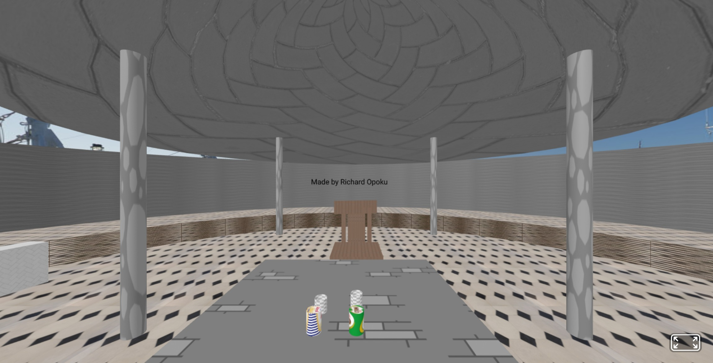

# COMPUTER GRAPHICS 41.008.198.23

## 3D Virtual Environment

This project is a 3D virtual environment created with A-Frame, featuring an interactive scene with furniture, objects, and animations.

## Features

- Interactive 3D environment viewable in any modern web browser
- Detailed furniture models (table and chairs)
- Animated elements (floating cylinders and rotating box)
- Custom textures and materials
- 360-degree panoramic background
- Responsive design that works across devices

## Getting Started

### Prerequisites

No special installation is required to view this project. You only need:
- A modern web browser (Chrome, Firefox, Edge, Safari)
- Internet connection (for initial loading)

### Viewing the Project

1. Simply open the `assignment.html` file in your web browser
2. Navigate the scene using:
   - Mouse: Click and drag to look around
   - WASD keys: Move forward, left, backward, right
   - Arrow keys: Alternative movement controls

## Technologies Used

- [A-Frame](https://aframe.io/) - Web framework for building virtual reality experiences
- HTML5
- Custom textures and 3D models

## Project Structure

- `assignment.html` - Main project file
- `script/aframe.js` - A-Frame framework
- `textures/` - Directory containing all texture assets
- Various image assets (milo.jpg, download.jpg, etc.)

## Future Improvements

- Adding interactive elements
- Implementing user controls for object manipulation
- Adding sound effects and background music
- Optimizing performance for mobile devices

## Credits

Created by Richard Opoku for COMPUTER GRAPHICS 41.008.198.23

## License

This project is provided for educational purposes.